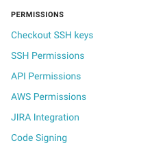

# 各CIの初期設定
以下の各クラウドCIに関して、アプリをビルドできるようにするまでの初期設定の仕方について明記しています。

## 前提作業
以下の作業を簡単にやってくれるか、1から自前でやるかの違いがあります。

 - iOSアプリをビルドする上では、p12ファイルとProvisioning Profileが無ければいけません。
 - p12ファイルはkeychainに登録する必要があります。
 - Provisioning Profileは特定の場所にある必要があります。


### Bitrise
#### Webからの設定


必要なp12ファイルと、Provisioning Profileを上記の設定画面上にアップロードすればOKです。
ファイルがわからない場合は、以下のコマンドで必要なファイルを取得してくれるので、取得したファイルをアップロードすればOKです。

```
bash -l -c "$(curl -sfL https://raw.githubusercontent.com/bitrise-tools/codesigndoc/master/_scripts/install_wrap.sh)"
```


### CircleCI
#### Webからの設定


設定画面の「Code Signing」からp12ファイルとProvisioning ProfileをアップロードすればOKです。


### Travis CI
Travis CIではWebページから設定をすることはできず、自身でファイルを管理する＆自らコマンドを叩く必要があります。

#### 事前準備
事前におこなう準備は以下のとおりです。

 1. travisコマンドのインストール
   - `gem install travis --no-document`
   - `travis login`
   - `travis enable`
 1. p12ファイルとProvisioning Profileを用意
   - p12ファイルはパスフレーズ設定をしておく 
 1. 1で用意したファイルをtar
   - `tar cvf secrets.tar dist.p12 sample.mobileprovision`
 1. できたtarファイルを暗号化する
   - `travis encrypt-file secrets.tar secrets.tar.enc`
   - 実行後に表示される文字列をコピペしておく
     - 例) `openssl aes-256-cbc -K $encrypted_xxxxx_key -iv $encrypted_xxxxx_iv -in ./travis/secrets.tar.enc -out ./travis/secrets.tar -d`
     - $encrypted\_xxxxx\_keyの値は設定済みになっています
 1. 暗号化したファイルはgithub上で管理する

#### Fastlaneの用意
keychainの設定やアプリのビルドなどはFastlaneに任せてしまいます。

 - [Fastlaneの例](https://github.com/tarappo/ci-sample-ios/blob/master/fastlane/Fastfile)


```
lane :setup_certificate do
  keychain_name = "ios-build.keychain"
  keychain_password = SecureRandom.base64

  create_keychain(
      name: keychain_name,
      password: keychain_password,
      default_keychain: true,
      unlock: true,
      timeout: 3600,
      add_to_search_list: true
  )

  import_certificate(
      certificate_path: "travis/dist.p12",
      certificate_password: ENV["KEY_PASSWORD"],
      keychain_name: keychain_name,
      keychain_password: keychain_password
  )
end
```
[Travis CIの公式からの引用](https://docs.travis-ci.com/user/common-build-problems/#Mac%3A-macOS-Sierra-(10.12)-Code-Signing-Errors)

#### 環境変数の設定
 - KEY_PASSWORD
   - p12ファイル出力時に設定したパスフレーズ
 - GYM_CODE_SIGNING_IDENTITY
   - code-signing identity
   - 例) iPhone Distribution: xxxxxx

#### .travis.ymlの用意
上記、全ての準備が終わったら、`.travis.yml`を用意します。

詳細は、以下の[.travis.yml](https://github.com/tarappo/ci-sample-ios/blob/master/.travis.yml)に書いてありますが一部ピックアップして説明しておきます。

解凍後、keychain周りの設定をfastlaneでおこない、その後Provisioning Profileを特定の場所に置きます。

```
before_script:
  - bundle exec fastlane setup_certificate
  - mkdir -p ~/Library/MobileDevice/Provisioning\ Profiles
  - cp ./travis/*mobileprovision ~/Library/MobileDevice/Provisioning\ Profiles/
```

あとはアプリのビルドなりをすればOKです。


### NEVERCODE
#### Webからの設定

### Buddybuild
#### Webからの設定
